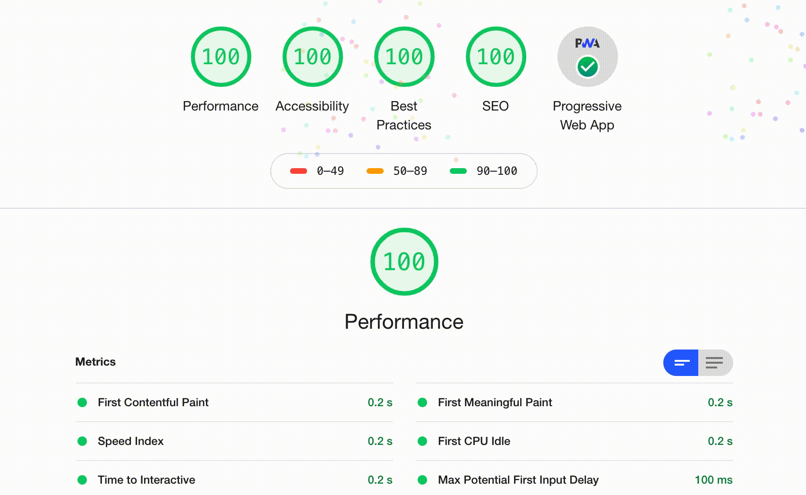

  <h1>React Isomorphic PWA</h1>

 
Fast production ready boilerplate backed by the MERN stack. Built to provide the best possible developer experience with scaleability, performance and best practices in mind.

 
 
 

 
.
 

 
 

  Created and maintained with love ❤️ by your friendly neighborhood coder <a href="https://github.com/EudyContreras">Eudy Contreras</a>.

 

## Technologies

* TS Node
* Babel
* React JSX/TSX
* React Router
* Hot Module Replacement
* Redux State Management
* Express with HTTP/2
* MongoDB
* Mongoose
* Webpack
* Docker
* Morgan
* Nodemon
* SASS (SCSS)
* ESList TSLint

## Features:

<dl>
  <dt>Predictable state managemen</dt>
  <dd>Read-only predictable, flexible and easy to debug data state using redux..</dd>

  <dt>Next generation JavaScript</dt>
  <dd>Write next gen type safe JS using features such as Spread and Rest Operator, Imports and Exports, Arrow functions, JSX/TSX syntax, template strings, object destructuring and more.</dd>

  <dt>Modularized CSS</dt>
  <dd>Write cheap, modular and composable CSS using SASS or SCSS. Eliminates style clashes with unique generated class names. Ship only the critical CSS for the best user experience and performance.</dd>

  <dt>React-Router</dt>
  <dd>Create universal routings using the industry's standard react-router. React Router allows you to easily add navigateable pages to your application. It also works nicely with route-based code splitting</dd>

  <dt>Fast Refresh and Instant Feedback</dt>
  <dd>Enjoy the best DX (Developer eXperience) with the power of HMR and Fast Refresh. All the page content is updated real-time as you make changes. Both the server and client side of the application will hot reload with every change.</dd>
  
  <dt>Code Splitting</dt>
  <dd>Allows component based code splitting using loadable components for a consistently fast application that dynamically loads the chunks needed at runtime. 
  
  <dt>Typescript</dt>
  <dd>Write highly scalable, maintainable and self-documented code which is easy-to-debug in large applications and codebases with a highly productive development experience.</dd>
  
  <dt>Efficient Compression</dt>
  <dd>Uses lightweight and highly efficient compression methods to provides smallest bundles possible made possible with: Gzip and Brotli compression</dd>
  
  <dt>Universal/Isomorphic React</dt>
  <dd>Render the content on both the server and the client for a full isomorphic experience. The app allows you to seamlessly switch between CSR and SSR. An Isomorphic approach can for example allow the initial page to be rendered on the server while subsequent pages load directly from the client.</dd>
  <ul>
  <li><b>Fast initial paga</b>  - Prevents flashing a blank page to the user and improves the user experience. Perfect for SPAs
  <li><b>Improved SEO</b> - Provides consistent SEO performance. Google favors sites with faster load times.
  </ul>
  <dt>Progressive Web App</dt>
  <dd>Reap of the benefits of all the features of an <b>Offline-First</b> fast and reliable Progressive Web Application right out of the box. A PWA allows users to have the best possible native application like experience even without an active internet connection.</dd>
   
<ul>
  <li><b>App-like</b>  – Feels like an app to the user with app-style interactions and navigation. PWAs provides a similar experience without the need for a install.</li>
  <li><b>Reliable</b> – Loads instantly and does not keep the users waiting even with limited network connectivity.
  <li><b>Engaging</b> – Keep users engaged and up to date by using rich push notifications.</li>
  <li><b>Offline-First</b> – Allows the site to work offline by using Service Workers cache first approach. This reduces network calls.</li>
  <li><b>Fresh</b>  – Always up-to-date due to the service worker background sync</li>
  <li><b>Progressive</b>  – Works for every user, regardless of browser choice, using progressive enhancement principles..</li>
  <li><b>Responsive</b>  – Fit any form factor: desktop, mobile, tablet, or forms yet to emerge.</li>
  <li><b>Safe</b>  – Served via HTTPS to prevent snooping and ensure content hasn’t been tampered with.</li>
  <li><b>Discoverable</b>  – Are identifiable as “applications” thanks to the manifests and service worker registration, and discoverable by search engines.</li>
  <li><b>Installable</b>  – Provides homescreen icons without the use of an App Store. Can be installed on all devices and provide a stand alone experience.</li>
  <li><b>Linkable</b>  – Can easily be shared via a URL, and does not require complex installation.</li>
</ul></dd>  

## Requirements

* [node & npm](https://nodejs.org/en/)

## Install and run project.

* `git clone `
* `npm install`

#### All scripts

* `start`: Starts the server for the current build
* `cleanup`: Cleans up the dist and build folders
* `compile-ts`: Compiles the ts code into js and copies necessary files to dist folder
* `build:server:watch`: Builds, packs and watches the server using webpack
* `build:client:watch:`: Builds, packs and watches the client using webpack
* `build:prod`: Builds, packs all the entries in production mode
* `build:dev`: Builds, packs all the entries in development mode
* `build:prod:start`: Builds, packs all the entries in production mode and runs the server
* `build:dev:start`: Builds, packs all the entries in devlopment mode and runs the server 
* `debug:hot`: Starts the server in hot mode with Universal Rendering
* `debug:hot:server`: Runs the server using nodemon.
* `debug:hot:client`: Runs the client using webpack-dev-server and HMR. Note that this will run only the client on CSR

#### Build project.

* `npm run build:dev` Builds the code into a bundle and places the code in the build folder.
* `npm run build:prod` Builds and minifies the code into a bundle and plcaes the code in the dist folder.

#### Build and Run project.

* `npm run build:dev:start` Runs the development version of the applicatipn.
* `npm run build:prod:start` Runs the production version of the applicatipn.

#### Debug project

The scripts specified here are used for debugging purpose. Running this scripsts
will run the code in with hot-reload modes. Nodemon is used for the server and webpacks dev-sever HMR is used for
the client together with the react-fast-refresh plugin.

* `npm run debug:hot:server` Runs the server using nodemon.
* `npm run debug:hot:client` Runs the client using webpack-dev-server and HMR.´
* `npm run debug:hot` Runs the the full configuration by executing both the hot server and hot client

## License

This project is licensed under the MIT License - see the [**Licence**](./LICENSE) file for details
