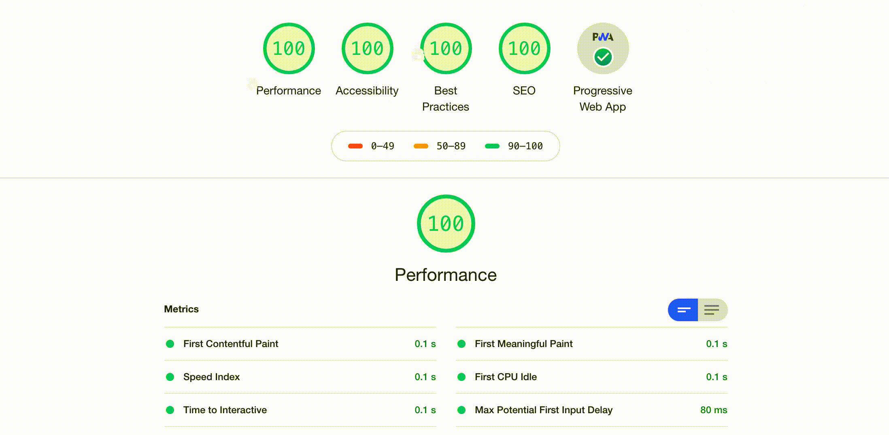

  <h1>React Isomorphic PWA</h1>

### Isomorphic react PWA backed by Express and MongoDB

A production ready boilerplate backed by express and mongoDB using the
MERN stack architecture. It features a fully installable Isomorphic/Universal rendering experience using react, as
a well as redux for state management. The boilerplate is highly customizable and it allows
you to choose the render method of choice. (SSR, CSR)

.

  Created and maintained with love ❤️ by your friendly neighborhood coder <a href="https://github.com/EudyContreras">Eudy Contreras</a> </a>.

### Technologies

* TS Node
* Babel
* React JSX/TSX
* React Router
* Redux State Management
* Express with HTTP/2
* MongoDB
* Mongoose
* Webpack 4
* Docker
* SASS (SCSS)
* ESList TSLint

### Supports out of the box

* Universal rendering using Node and React
* Environment Variables
* React-Fast-Refresh Hot Module Reload
* MVC Architecture with SSR
* Supports Installation
* Supports Notifications
* Supports Background Sync
* Supports Periodic Sync
* Supports background and periodic-sync envents
* Gzip and Brotli compression
* Webjobs using AgendaJS
* Supports CSS Modules and critical CSS
* Suppors component styling using sass with isomorphic-style-loader
* Easy setup for component based code-splitting using loadable/components
* Docker containarised

### Requirements

* [node & npm](https://nodejs.org/en/)

### Install project.

* `git clone `
* `npm install`

### All scripts

* `start`: Starts the server for the current build
* `cleanup`: Cleans up the dist and build folders
* `compile-ts`: Compiles the ts code into js and copies necessary files to dist folder
* `build:server:watch`: Builds, packs and watches the server using webpack
* `build:client:watch:`: Builds, packs and watches the client using webpack
* `build:prod`: Builds, packs all the entries in production mode
* `build:dev`: Builds, packs all the entries in development mode
* `build:prod:start`: Builds, packs all the entries in production mode and runs the server
* `build:dev:start`: Builds, packs all the entries in devlopment mode and runs the server 
* `debug:hot`: Starts the server in hot mode with Universal Rendering
* `debug:hot:server`: Runs the server using nodemon.
* `debug:hot:client`: Runs the client using webpack-dev-server and HMR. Note that this will run only the client on CSR

### Build project.

* `npm run build:dev` Builds the code into a bundle and places the code in the build folder.
* `npm run build:prod` Builds and minifies the code into a bundle and plcaes the code in the dist folder.

### Build and Run project.

* `npm run build:dev:start` Runs the development version of the applicatipn.
* `npm run build:prod:start` Runs the production version of the applicatipn.

### Debug project

The scripts specified here are used for debugging purpose. Running this scripsts
will run the code in with hot-reload modes. Nodemon is used for the server and webpacks dev-sever HMR is used for
the client together with the react-fast-refresh plugin.

* `npm run debug:hot:server` Runs the server using nodemon.
* `npm run debug:hot:client` Runs the client using webpack-dev-server and HMR.´
* `npm run debug:hot` Runs the the full configuration by executing both the hot server and hot client

### License

This project is licensed under the MIT License - see the [**Licence**](./LICENSE) file for details
